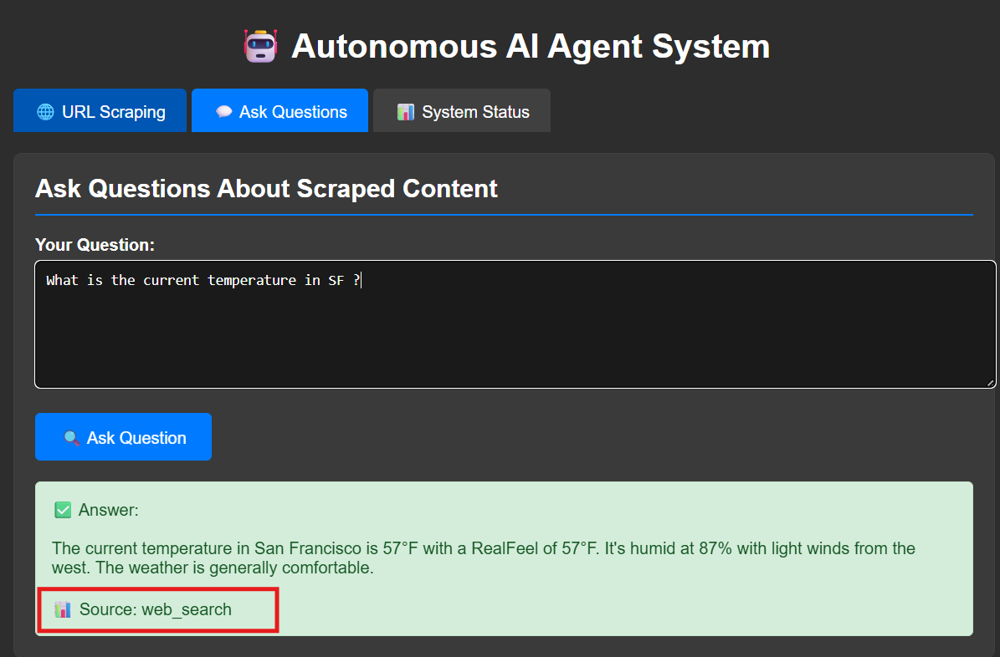

# Autonomous AI Agent System

A complete autonomous agentic AI system that scrapes URLs using MCP tools, stores content in Pinecone vector database, and provides intelligent query responses with automatic routing to web search when needed.

## 🌟 Key Features

- 🌐 **URL Scraping**: Uses MCP Firecrawl tools for comprehensive web scraping
- 🧠 **Vector Storage**: Automatic chunking and storage in Pinecone vector database
- 🔍 **Intelligent Querying**: Searches vector DB first, falls back to Tavily web search
- 🎯 **Smart Routing**: Automatically determines best information source based on relevance
- 🔌 **REST API**: Full REST API with JSON responses
- 📡 **Server-Sent Events**: Real-time SSE endpoint for live updates
- 📊 **System Monitoring**: Real-time status monitoring of all components
- 🌙 **Dark Mode UI**: Beautiful web interface with dark theme

## 🚀 Quick Setup

### 1. **Clone and Setup**
```bash
git clone <repository-url>
cd AgenticAI_WebSearch
pip install -r requirements.txt
```

### 2. **Environment Configuration**
```bash
cp env_example.txt .env
# Edit .env with your API keys
```

### 3. **Required API Keys**
Create a `.env` file with the following keys:
```env
OPENAI_API_KEY=your_openai_api_key_here
PINECONE_API_KEY=your_pinecone_api_key_here
PINECONE_ENVIRONMENT=your_pinecone_environment
TAVILY_API_KEY=your_tavily_api_key_here
MCP_SERVER_URL=http://localhost:8000
```

### 4. **Start MCP Firecrawl Server**
```bash
# Set environment variables
$env:PORT="8000"
$env:SSE_LOCAL="true"
$env:FIRECRAWL_API_KEY="fc-FIRECRAWL_API_KEY"

# Start the MCP server
firecrawl-mcp
```

**Expected Output:**
```
Starting server on port 8000
MCP SSE Server listening on http://localhost:8000
SSE endpoint: http://localhost:8000/sse
Message endpoint: http://localhost:8000/messages
```

### 5. **Run Application**
```bash
python main.py
```

**Expected Output:**
```
Starting Autonomous AI Agent System...
Launching FastAPI server on localhost:8000
INFO: Uvicorn running on http://localhost:8000 (Press CTRL+C to quit)
```

### 6. **Access Interface**
- **Web Interface**: Open `test_scraping.html` in your browser
- **API endpoints**: http://localhost:8000
- **SSE endpoint**: http://localhost:8000/sse
- **API documentation**: http://localhost:8000/docs

#### This interface is much more user-friendly than the Swagger UI and provides a complete web interface for your AI Agent System!
execute this command in terminal:
start testing/test_scraping.html

## 🎯 Smart Routing Mechanism

The system implements intelligent routing between vector database and web search:

### **Routing Logic:**
1. **Query Processing**: User asks a question
2. **Vector Search**: Search Pinecone with similarity threshold 0.7
3. **Relevance Check**: If top result score < 0.8 → **Web Search**
4. **Content Delivery**: Return most relevant information

### **Example Scenarios:**

#### ✅ **Vector Database Route** (High Relevance)
- **Query**: "How to Build ETL pipeline with Lakeflow Declarative Pipelines?"
- **Score**: 0.921 (≥ 0.8)
- **Result**: Uses scraped Databricks documentation
- **Source**: `vector_database`

#### ✅ **Web Search Route** (Low Relevance)
- **Query**: "Who won IPL 2025?"
- **Score**: 0.676 (< 0.8)
- **Result**: Falls back to Tavily web search
- **Source**: `web_search`

#### ✅ **Web Search Route** (No Content)
- **Query**: "What is current temperature in NY?"
- **Score**: No matches found
- **Result**: Uses Tavily web search
- **Source**: `web_search`

## 📸 Screenshots

### **1. Cursor IDE - Using Tools with Chat Agent**

*Shows the Cursor IDE interface with the AI chat agent actively using MCP tools for web scraping and data processing. The interface displays real-time tool execution and response generation.*

### **2. MCP Tools Available in Cursor**

*Demonstrates the MCP (Model Context Protocol) tools integration in Cursor IDE, showing available Firecrawl scraping tools and their capabilities for web content extraction.*

### **3. Swagger API Interface**

*The Swagger UI interface showing all available REST API endpoints for the Autonomous AI Agent System, including scraping, querying, and status monitoring endpoints.*

### **4. User Query - Web Search Response**

*Example of a user query that triggered web search fallback when vector database content wasn't relevant enough, showing the intelligent routing mechanism in action.*

### **5. User Query - Pinecone Database Fetch**

*Demonstrates a high-relevance query that successfully retrieved information from the Pinecone vector database, showing the system's ability to find and return relevant scraped content.*

> **📝 Note**: These screenshots showcase the complete workflow of the Autonomous AI Agent System, from development in Cursor IDE with MCP tools integration, to the web interface, API documentation, and intelligent query routing between vector database and web search.

## 🔧 Usage

### **Web Interface**
1. Open `test_scraping.html` in your browser
2. **URL Scraping Tab**: Enter URLs to scrape and store
3. **Ask Questions Tab**: Ask questions about scraped content
4. **System Status Tab**: Monitor component health

### **API Endpoints**

#### **Scrape URL**
```bash
curl -X POST http://localhost:8000/scrape \
  -H "Content-Type: application/json" \
  -d '{"url": "https://example.com", "deep_scrape": false}'
```

#### **Ask Question**
```bash
curl -X POST http://localhost:8000/query \
  -H "Content-Type: application/json" \
  -d '{"query": "What is the main topic of the scraped content?"}'
```

#### **Check Status**
```bash
curl http://localhost:8000/status
```

#### **SSE Connection**
```javascript
const eventSource = new EventSource('http://localhost:8000/sse');
eventSource.onmessage = function(event) {
    console.log('Received:', event.data);
};
```

## 🏗️ Architecture

```
AgenticAI_WebSearch/
├── main.py                    # FastAPI application entry point
├── config/settings.py         # Configuration management
├── agents/                    # AI agent implementations
│   ├── base_agent.py         # Base agent class
│   ├── scraping_agent.py     # MCP scraping agent
│   ├── search_agent.py       # Tavily search agent
│   └── orchestrator.py       # Main coordination agent
├── services/                  # Core services
│   ├── mcp_client.py         # MCP tools integration
│   ├── pinecone_service.py   # Vector database service
│   ├── embedding_service.py  # OpenAI embedding service
│   └── tavily_service.py     # Web search service
├── utils/                     # Utility functions
├── test_scraping.html         # Web interface
└── requirements.txt           # Python dependencies
```

## ⚙️ Configuration

### **Environment Variables**
```env
# OpenAI Configuration
OPENAI_API_KEY=your_openai_api_key
EMBEDDING_MODEL=text-embedding-ada-002

# Pinecone Configuration
PINECONE_API_KEY=your_pinecone_api_key
PINECONE_ENVIRONMENT=your_environment
PINECONE_INDEX_NAME=firecrawl-index

# Tavily Configuration
TAVILY_API_KEY=your_tavily_api_key

# MCP Configuration
MCP_SERVER_URL=http://localhost:8000

# Server Configuration
GRADIO_HOST=localhost
GRADIO_PORT=8000

# Processing Configuration
CHUNK_SIZE=1000
SIMILARITY_THRESHOLD=0.7
```

### **Routing Thresholds**
- **Initial Search**: 0.7 (minimum similarity to consider)
- **Relevance Check**: 0.8 (minimum score to use vector database)
- **Fallback**: Web search when score < 0.8 or no results

## 🐛 Debugging Steps

### **1. PowerShell Environment Setup**
```powershell
# Set required environment variables
$env:PORT="8000"
$env:SSE_LOCAL="true"
$env:FIRECRAWL_API_KEY="fc-FIRECRAWL_API_KEY"

# Start MCP server
firecrawl-mcp
```

### **2. Check MCP Server Status**
```powershell
# Verify MCP server is running
curl http://localhost:8000/messages
```

### **3. Monitor Application Logs**
```bash
# Run with verbose logging
python main.py

# Check for these log messages:
# - "MCP SSE Server listening on http://localhost:8000"
# - "Connected to Pinecone index: firecrawl-index"
# - "Initialized OpenAI embedding service"
```

### **4. Test Individual Components**
```bash
# Test Pinecone connection
curl http://localhost:8000/status

# Test scraping
curl -X POST http://localhost:8000/scrape \
  -H "Content-Type: application/json" \
  -d '{"url": "https://example.com"}'

# Test querying
curl -X POST http://localhost:8000/query \
  -H "Content-Type: application/json" \
  -d '{"query": "test query"}'
```

### **5. Common Issues & Solutions**

#### **MCP Connection Timeout**
```
Error: MCP API call failed: HTTPConnectionPool(host='localhost', port=8000): Read timed out
```
**Solution**: Ensure MCP server is running and accessible

#### **OpenAI Embedding Error**
```
Error: You tried to access openai.Embedding, but this is no longer supported in openai>=1.0.0
```
**Solution**: Use `openai==0.28.1` in requirements.txt

#### **Pinecone Dimension Mismatch**
```
Error: Vector dimension 384 does not match the dimension of the index 1536
```
**Solution**: Index is configured for 1536 dimensions (text-embedding-ada-002)

#### **Low Relevance Scores**
```
Match 1: Score=0.676, URL=https://example.com
```
**Solution**: System will automatically fall back to web search (score < 0.8)

## 📊 System Status Monitoring

The system provides real-time monitoring of all components:

- **🟢 MCP Tools**: Firecrawl scraping service
- **🟢 Pinecone**: Vector database connection
- **🟢 Tavily**: Web search service
- **🟢 Embedding Service**: OpenAI text embeddings
- **📈 Vector Count**: Number of stored vectors in database

## 🔄 Workflow Example

1. **Scrape URL**: User scrapes Databricks documentation
2. **Store Vectors**: Content chunked and stored in Pinecone
3. **Ask Question**: "How to build ETL pipeline?"
4. **Vector Search**: Find relevant content (score: 0.921)
5. **Return Answer**: Use vector database content
6. **Ask Different**: "What's the weather in NY?"
7. **Low Relevance**: No relevant content found
8. **Web Search**: Use Tavily for current information

## 📝 License

MIT License - feel free to modify and distribute as needed.

## 🤝 Contributing

1. Fork the repository
2. Create a feature branch
3. Make your changes
4. Test thoroughly
5. Submit a pull request
